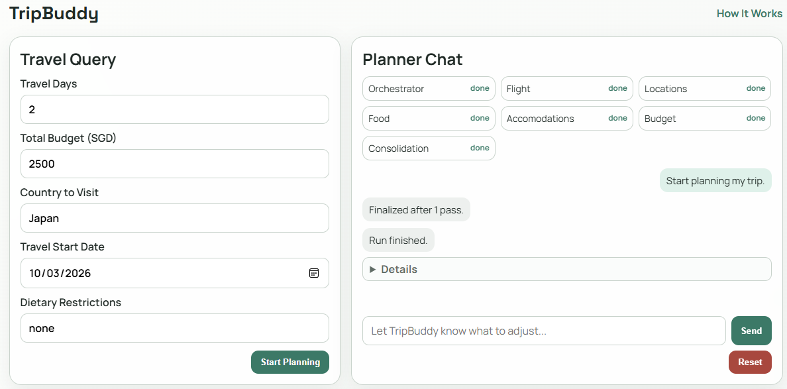
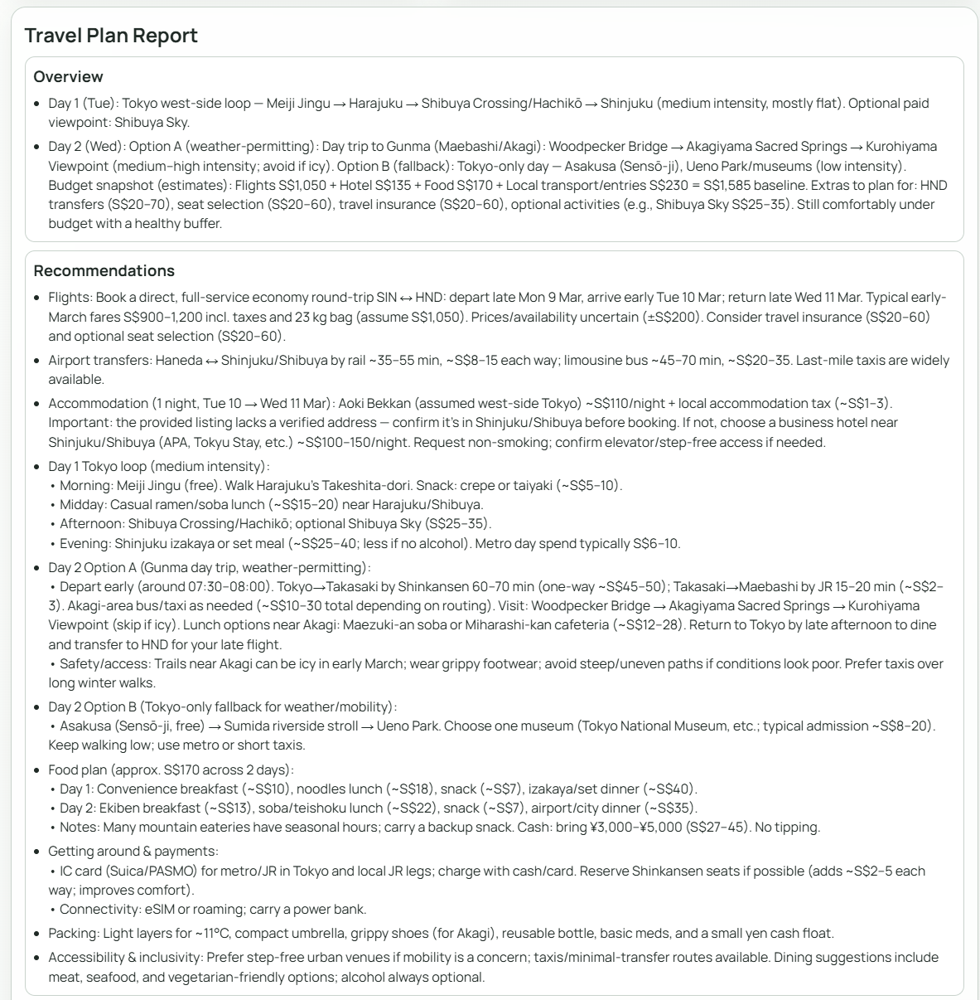
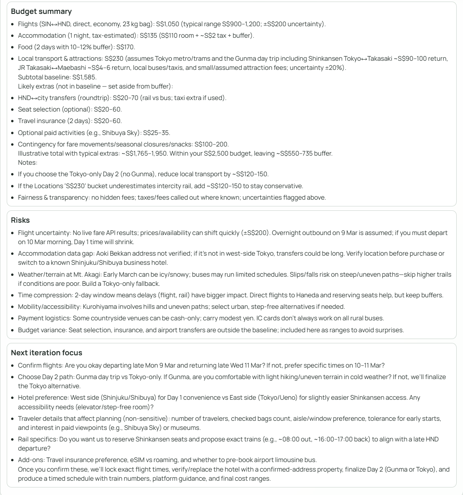

# TripBuddy Frontend

React frontend for TripBuddy travel planning.

## Tech Stack
- ReactJS
- Vite
- React Router
- Browser WebSocket API
- Fetch API (REST integration with FastAPI backend)

## Features
- One-page travel query intake form
- Optional `/help` tutorial page
- Chat-style refinement after initial plan
- Live planning progress + chat via WebSocket
- Readable report sections (not raw JSON)
- Optimization pass indicator (`Optimization pass x/y`) during reruns
- Collapsible `Details` panel for condensed technical progress logs
- Stale session recovery: auto-reset local state when backend returns unknown/expired session

## Screenshots
> Place image files in `TripBuddy/frontend/docs/images/` with the names below.

### Planner


### Report (Overview & Recommendations)


### Report (Budget, Risks, Next Iteration)


## Frontend Structure
- `src/App.jsx`: app routes only
- `src/pages/HomePage.jsx`: planner page composition
- `src/pages/HelpPage.jsx`: tutorial page
- `src/components/TravelForm.jsx`: intake form UI
- `src/components/PlannerChat.jsx`: chat panel and refinement controls
- `src/components/ProgressSteps.jsx`: step status cards
- `src/components/ReportPanel.jsx`: report renderer
- `src/hooks/usePlannerSession.js`: planner state orchestration and UI actions
- `src/services/plannerApi.js`: REST API calls
- `src/services/plannerSocket.js`: WebSocket transport helpers
- `src/utils/planner.js`: shared planner helpers/constants
- `src/assets/styles.css`: global app styles

## Requirements
- Node.js 18+
- Backend API running at `http://localhost:8000` (default)

## Setup
```bash
npm install
npm run dev
```

Open `http://localhost:5173`.

## Build
```bash
npm run build
npm run preview
```

## Environment
Optional Vite env var:
- `VITE_API_BASE` (default: `http://localhost:8000`)
- `VITE_WS_BASE` (default: derived from `VITE_API_BASE`)

Example `.env`:
```bash
VITE_API_BASE=http://localhost:8000
VITE_WS_BASE=ws://localhost:8000
```

## API Endpoints Used
- `POST /api/session`
- `GET /api/session/{session_id}/snapshot`
- `POST /api/session/{session_id}/stop`
- `WS /ws/session/{session_id}`
- `POST /api/session/{session_id}/plan/stream` (fallback)
- `POST /api/session/{session_id}/plan` (fallback)
- `GET /api/health`
